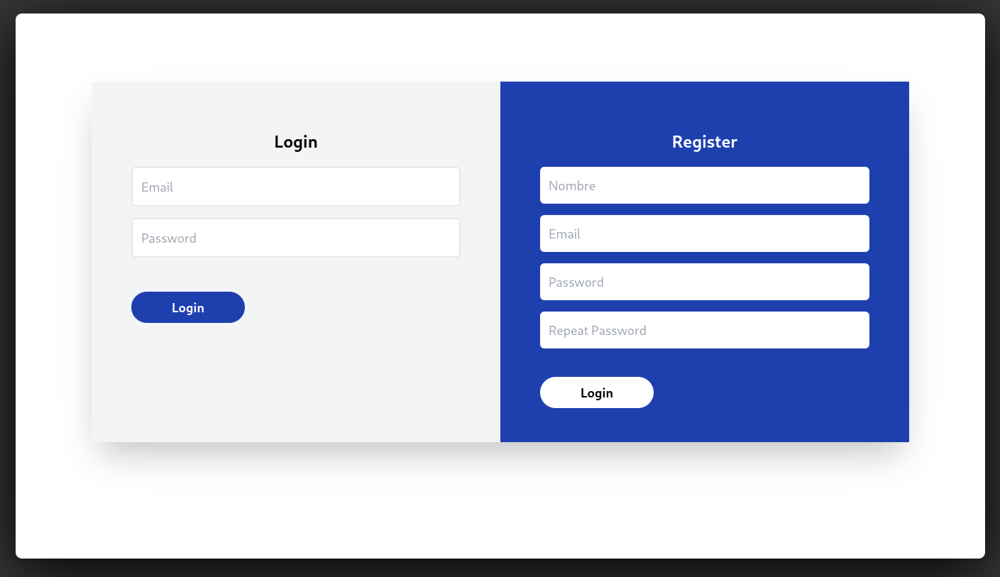
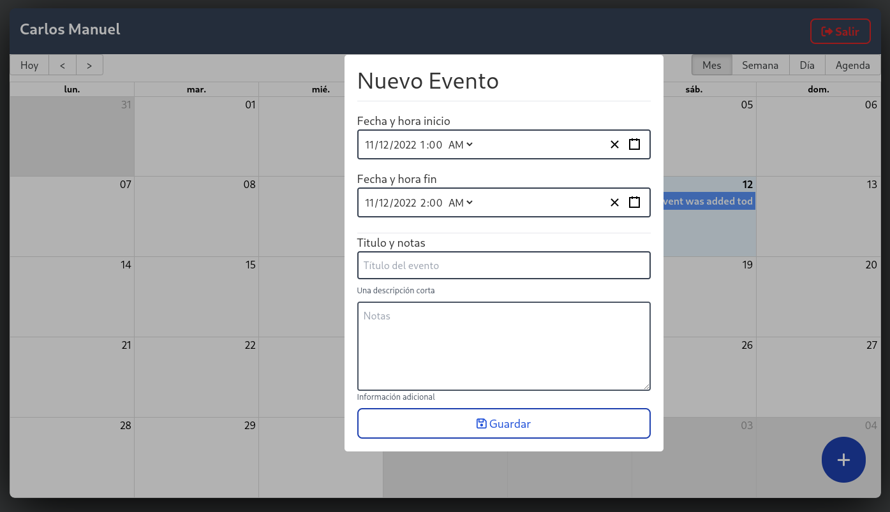

# Calendar App

En esta aplicación se pueden crear recordatorios en los dias del año, para así simpre poder estar atento y no tener siempre que recordar lo que tienes que hacer un dia en específico.




> La aplicación esta contruida en dos partes, está esta que es la aplicación de _frontend_ y el _backend_ que se encuentra en [este repositiorio](https://calendar-nodejs-reactcours.herokuapp.com)

Esta es una aplicación construida en __React__ con el objectivo de practicar con la tecnología, por lo que la páguina no esta del todo optimizada.

Si quieres ver la aplicación en producción puedes verla [aquí](https://calendar-nodejs-reactcours.herokuapp.com)

Si quieres correrla en desarrollo:

- Primero debes ir y descargar el __backend__ de esta páguina y correrlo en local. El código lo puedes ver [aquí](https://github.com/cmglezpdev/Calendar-App-Backend)
- Después de ejecutar el __backend__, puedes ejecutar los siguientes comandos en este proyecto:

```bash
# install dependencies
npm install

# run
npm start
```

__🎉Y LISTO!! YA TIENES LA APLICACIÓN EN LOCAL🎉__